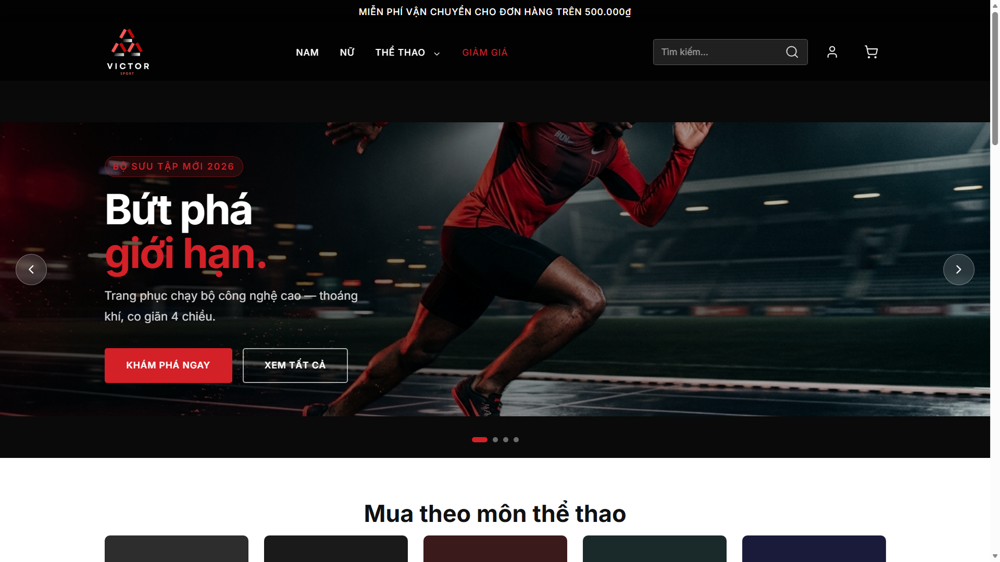
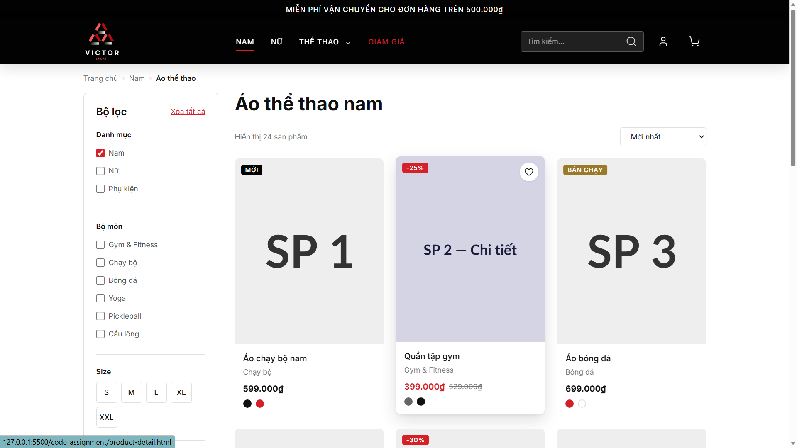
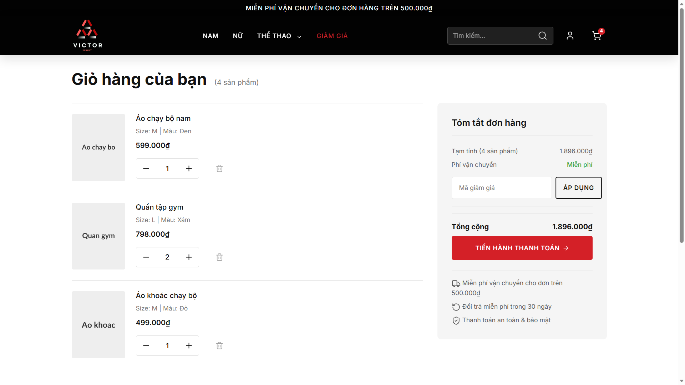
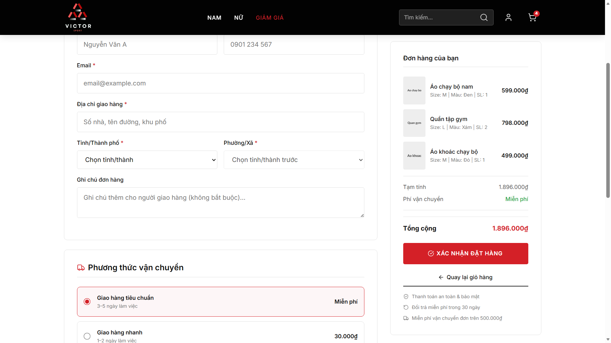

# Victor Sport – E-commerce Frontend

Victor Sport is a front-end assignment for a fictional sportswear e-commerce brand. It demonstrates a complete storefront journey: browsing products, viewing product details, managing a cart, and completing a simulated checkout.

The project runs entirely in the browser. No packages, build step, backend service, or environment variables are required. Cart and order data are stored locally with `localStorage`.

## Screenshots

### Home page



### Product catalogue



### Shopping cart



### Checkout



## Implemented pages

| Page                  | Description                                                                                                                   |
| --------------------- | ----------------------------------------------------------------------------------------------------------------------------- |
| `index.html`          | Home page with a hero carousel, sport categories, featured products, promotion banner, and newsletter section.                |
| `products.html`       | Product catalogue with filter, sort, wishlist, and pagination interfaces.                                                     |
| `product-detail.html` | Product details, image gallery, colour and size selection, quantity selector, product information tabs, and related products. |
| `cart.html`           | Dynamic cart that reads local data, updates quantities, removes items, and recalculates totals.                               |
| `checkout.html`       | Delivery form, shipping and payment options, validation, and simulated order confirmation.                                    |
| `order-success.html`  | Confirmation screen showing the generated order ID, delivery information, and an order summary.                               |
| `sport.html`          | A sports-category landing page, currently illustrated with Pickleball content.                                                |
| `login.html`          | Login and sign-up interface with tab switching and password visibility controls.                                              |

## Implemented interactions

- Home-page carousel with five-second autoplay, previous/next controls, dot navigation, touch swipe support, hover pause, and reduced-motion support.
- Responsive desktop and mobile navigation, including mobile submenus and a sticky header shadow on scroll.
- Product image thumbnail switching, size/colour selection, quantity controls, and add-to-cart feedback.
- Cart state stored under `jp_cart` in `localStorage`; matching product ID, size, and colour variants are merged into one line item. The header cart badge stays in sync with the cart quantity.
- Demo cart items are seeded on the first empty-cart visit to demonstrate the cart flow.
- Checkout validates required inputs, recalculates the total for express shipping (30,000₫), generates a demo order ID, and stores the latest order under `jp_last_order`.
- Wishlist buttons provide a visual toggle within the current browser session.
- Accessibility-minded markup: semantic HTML, `aria-*` attributes, skip links, labelled form controls, and a live cart-count announcement.

## Technology

- HTML5
- Vanilla CSS3: design tokens/CSS variables, Flexbox, CSS Grid, and media queries
- Vanilla JavaScript (ES6+)
- [Lucide Icons](https://lucide.dev/) via CDN
- Inter font via Google Fonts CDN

## Project structure

```text
code_assignment/
├── css/
│   ├── reset.css          # Base reset and normalisation
│   ├── tokens.css         # Colours, typography, spacing, radii, and shadows
│   ├── layout.css         # Containers, grids, and global layout
│   ├── components.css     # Shared UI components
│   ├── pages.css          # Page-specific styles
│   └── responsive.css     # Tablet, mobile, and print breakpoints
├── data/
│   ├── products.json     # Reference product and demo-cart data
│   └── wards.json        # Reference ward data
├── images/
│   ├── home-page.png
│   ├── product-list-page.png
│   ├── card-page.png
│   ├── payment-page.png
│   ├── logo_brand.png
│   └── hero-slide-*.jpg
├── js/
│   └── main.js           # Shared interactions and cart logic
├── index.html
├── products.html
├── product-detail.html
├── cart.html
├── checkout.html
├── order-success.html
├── sport.html
├── login.html
└── README.md
```

## Run locally

Open `index.html` in a modern browser, or use a local development server for a more convenient workflow.

For example, in VS Code install the **Live Server** extension, then open `index.html` and select **Open with Live Server**.

## Current scope and limitations

- This is a front-end prototype. It has no backend, database, real authentication, or real payment gateway.
- `data/products.json` and `data/wards.json` are reference files in the repository. The product listing, filters, sorting, and pagination are currently static interfaces and are not connected to a live data-filtering implementation.
- Cart and order state exist only in the active browser's local storage. Clear site data in browser developer tools to reset the demo state.
- Some product images use `placehold.co`; fonts, icons, and certain images also rely on external CDN or image URLs, so an Internet connection is needed for those assets.

## Quick test flow

1. Open `product-detail.html`, select a size, and click **Add to cart**.
2. Open `cart.html`, change quantities or remove items, then check the total and cart badge.
3. Continue to checkout, complete the required fields, and select shipping and payment options.
4. Confirm the order to reach `order-success.html` and review the saved order summary.
